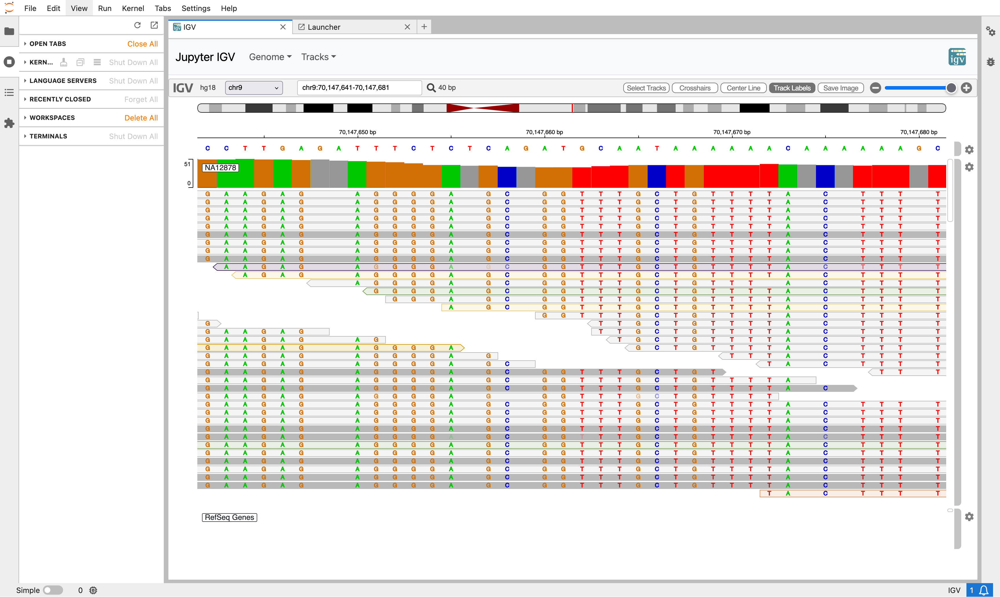
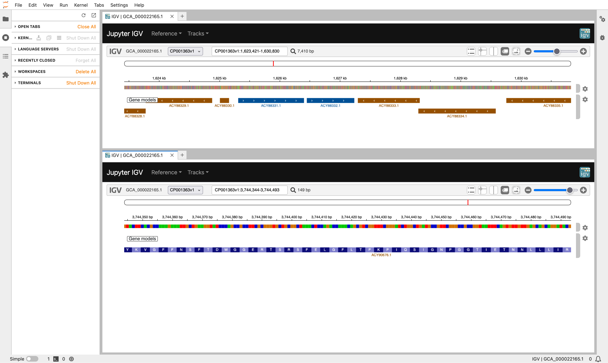

# IGV in JupyterLab

## Overview

JupyterLab Extension for IGV.





## Setup

### Build from source

Clone the repository:

```
$ git clone https://github.com/CLIMB-TRE/jupyter-igv.git
$ cd jupyter-igv/
```

Ensure you have Miniconda (or an alternative conda installer) available. Installation instructions for Conda can be found [here](https://docs.conda.io/projects/conda/en/latest/user-guide/install/index.html).

Create and activate a conda environment with JupyterLab and NodeJS:

```
$ conda create -n jupyterlab-ext -c conda-forge jupyterlab=4 nodejs=20
$ conda activate jupyterlab-ext
```

Install the extension dependencies with the JupyterLab package manager `jlpm`:

```
$ jlpm install
```

Build the extension and install it:

```
$ jlpm run build
$ pip install -ve .
```

You can now launch JupyterLab with:

```
$ jupyter lab
```

And the IGV extension will be ready on the launcher.

### Local development

If you wish to develop the extension, ensure you have followed the above steps to build, install and run the extension from source.

From there, you can simply modify the extension code and dependencies, and reinstall/rebuild the extension by executing:

```
$ jlpm install && jlpm run build && pip install -ve .
```

and then relaunching JupyterLab.

### Troubleshooting

If you are seeing the frontend extension, but it is not working, check that the server extension is enabled with:

```
jupyter server extension list
```

If the server extension is installed and enabled, but you are not seeing the frontend extension, check the frontend extension is installed with:

```
jupyter labextension list
```
